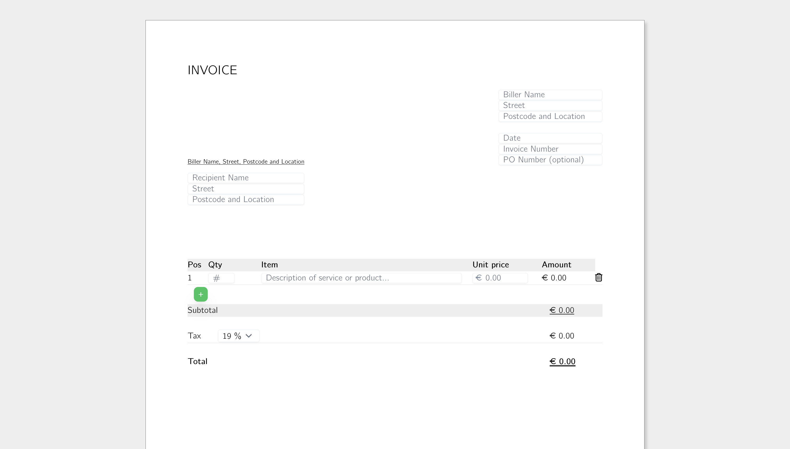

# Gener8Invoice

Gener8Invoice is a web and desktop application built with React, Django, and Electron. It allows users to generate and download invoices in PDF format. The application leverages a Django backend to handle invoice generation and a React frontend for the user interface.

## Features

- Generate invoices with detailed information.
- Download invoices as PDF files.
- Modern user interface with React.
- Robust server-side processing with Django.
- Desktop application with Electron.
- Integration with Tailwind CSS for styling.
- Uses FontAwesome for icons.

## Getting Started

### Prerequisites

- Node.js
- npm
- Python 3
- virtualenv

### Installation

Clone the repository:

```sh
git clone https://github.com/hkuennen/gener8invoice.git
cd gener8invoice
```

Install Node.js dependencies:

```sh
npm install
```

Set up the Python virtual environment and install dependencies:

On macOS/Linux:

```sh
python3 -m venv venv
source venv/bin/activate
pip install -r requirements.txt
```

On Windows:

```sh
python -m venv venv
.\venv\Scripts\activate
pip install -r requirements.txt
```

Build the React frontend:

```sh
npm run build
```

### Running the Application

Start the Django server:

```sh
npm run server
```

Start the Electron application:

```sh
npm run electron
```

### Building the Electron Application

```sh
npm run electron:build
```

## Web App

[](https://www.gener8invoice.com)
